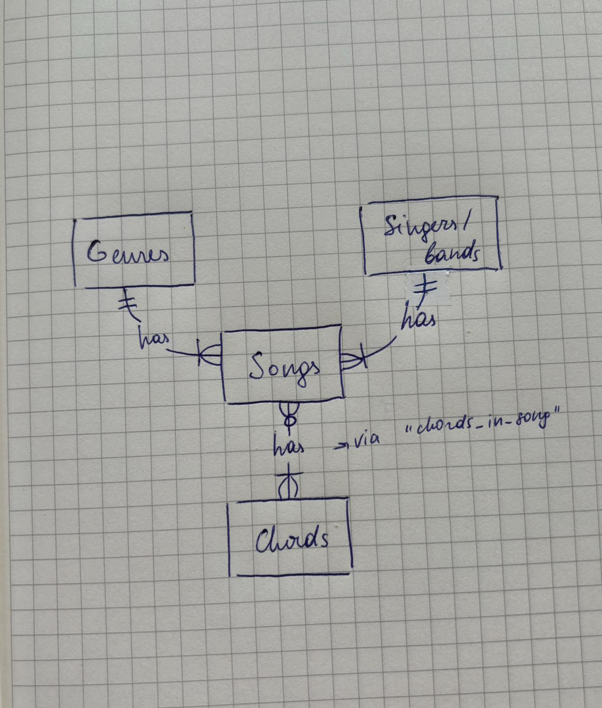

# Design Document

By Anastasia Tiganescu

Video overview: <(https://youtu.be/E06hIER6ybk)>

## Scope

The database I created includes all entities necessary for users to explore and analyze songs by genre, difficulty, singer, as well as track which chords are associated with specific songs. As such, included in the database's scope is:

* Singers/bands, including basic identifying information
* Genres, including basic identifying information
* Guitar chords, including basic identifying information
* Songs, including their title, release year, genre, singer, and learning difficulty for guitar
* Song-Chord Relationships, to map which songs use which chords

Out of scope are elements like practice history, personal song preferences, advanced music theory elements, like chord progressions or key signatures, lyrics and in-depth song analysis.

## Functional Requirements

This database will support:

* CRUD operations for songs, singers/bands, genres, and guitar chords.
* Viewing the relationship between songs and the guitar chords used in them, between songs and their singers, their genres
* Searching for songs based on title, genre, year of release, singer, and learning difficulty.
* Viewing songs with specific chords and learning difficulties for users who want to learn guitar.
* Adding new songs, singers, chords and genres.

The system will not support advanced features such as:

* Real-time chord playback or audio for learning songs.
* Suggestions or recommendations based on user preferences.
* Collaborative editing of song information or user-generated content.

### Representation

Entities are captured in SQLite tables with the following schema.

### Entities

The database includes the following entities:

#### Singers/bands

The `singers/bands` table includes:

* `id`, which specifies the unique ID for the artist or band as an `INTEGER`. This column has the `PRIMARY KEY` constraint applied to ensure uniqueness.
* `name`, which specifies the name of the singer or band as `TEXT`. Since names are text-based, `TEXT` is a fitting type.
* `start_year`, which specifies the year the artist or band began their career as an `INTEGER`. This helps track the artist's career timeline.
* `end_year`, which specifies the year the artist or band ended their career as an `INTEGER`. This can be `NULL` if the artist is still active. Thus, this column does not have the `NOT NULL` constraint.
* `main_genre`, which specifies the primary genre associated with the artist or band as `TEXT`. This column allows genre classification for artists and uses `TEXT` since genres are typically represented by words.

All columns except `end_year` are required and have the `NOT NULL` constraint applied.

### Genres

The `genres` table includes:

* `id`, which specifies the unique ID for the genre as an `INTEGER`. This column has the `PRIMARY KEY` constraint applied to ensure that each genre has a unique identifier.
* `name`, which specifies the name of the genre as `TEXT`. This is appropriate because genres are typically represented as descriptive text (e.g., "Rock", "Pop", "Jazz").
* `description`: which provides a brief description of the genre and is of type TEXT. The NOT NULL constraint ensures that every genre has a description, which is useful for providing more context about each genre.

All columns are required and hence have the `NOT NULL` constraint applied.

#### Songs

The `songs` table includes:

* `id`, which specifies the unique ID for the song as an `INTEGER`. This column has the `PRIMARY KEY` constraint applied to ensure that each song has a unique identifier.
* `title`, which specifies the name of the song as `TEXT`. This is appropriate since song titles are text-based.
* `release_year`, which specifies the year the song was released as an `INTEGER`. This column is important for querying songs based on their release year and using an integer allows for efficient sorting and filtering.
* `genre_id`, which is the ID of the genre of the song, represented as an `INTEGER`. This column has the `FOREIGN KEY` constraint applied, referencing the `id` column in the `genres` table. This ensures the integrity of relationships between songs and their respective genres.
* `singer_id`, which is the ID of the singer or band that performed the song, represented as an `INTEGER`. This column has the `FOREIGN KEY` constraint applied, referencing the `id` column in the `singers/bands` table. This ensures the integrity of relationships between songs and their respective artists.
* `learning_difficulty`: A `TEXT` column that classifies the difficulty of learning the song (e.g., Easy, Medium, Hard), constrained by NOT NULL with an additional `CHECK` constraint to ensure valid values.

All columns are required and hence have the `NOT NULL` constraint applied.

#### Guitar_Chords

The `guitar_chords` table includes:

* `id`, which specifies the unique ID for the guitar chord as an `INTEGER`. This column has the `PRIMARY KEY` constraint applied.
* `name`, which specifies the name of the chord as `TEXT`. Since chord names are typically alphanumeric (e.g., G major, A minor), `TEXT` is appropriate.
* `tone`, which specifies the tone of the chord (e.g., major, minor) as `TEXT`. This is descriptive and hence stored as `TEXT`.
* `difficulty`, which specifies the difficulty level of playing the chord as `TEXT`.

All columns are required and have the `NOT NULL` constraint applied.

### Relationships

The below entity relationship diagram describes the relationships among the entities in the database.

As detailed by the diagram:

* Each singer or band can produce one or more songs. Every singer or band must have at least one song associated with them, which ensures their active contribution to the music database. A song is linked to only one singer or band, establishing a clear relationship.

* Each song is associated with one and only one genre. This ensures that every song can be categorized under a specific genre. Additionally, each genre must have at least one song represented, guaranteeing that all genres in the database have associated music.

* A song can feature one or more guitar chords, allowing for musical complexity. A guitar chord may be used in zero or more songs, providing flexibility in its use. Chords can exist independently or be utilized across multiple songs. The relationship between songs and chords is managed through the mapping table "chords_in_song," which links each chord used in a song.

## Optimizations

To optimize the database for common queries, I have implemented the following indexes and views:

### Indexes
* `genres_name`- This index is created on the `name` column of the `genres` table. Since users frequently query songs by genre or want to list all genres available, this index helps optimize those queries by speeding up searches involving genre names.

* `chords_finder`- This index is created on the `chord_id` column of the `chords_in_song` table. This is beneficial because users often query which songs contain specific guitar chords. The index speeds up queries that involve finding chords associated with songs.

* `learn` - The index on `learning_difficulty` in the `songs` table optimizes queries that retrieve songs based on their difficulty level (easy, medium, or hard), which is a common query, particularly when users want to find songs that are easier or harder to learn.

* `song_title` - Since song titles are commonly queried, an index is created on the `title` column of the `songs` table to improve the speed of retrieving songs by their title.

* `song_release_year` - This index is created on the `release_year` column in the `songs` table to optimize queries that involve filtering or searching songs by their release year. Queries that analyze the relationship between genres and specific years benefit from this index.

### Views
* `full_songs` - This view joins the `songs` and `genres` tables to provide a simplified overview of song details, including the title, release year, genre name, and learning difficulty. It consolidates commonly accessed fields to make queries more efficient and user-friendly.

* `songs_and_chords` - This view joins the `songs`, `chords_in_song`, and `guitar_chords` tables to show song details along with the chords used in each song. It provides a quick way to access information about which chords are used in specific songs, helping users who want to learn songs based on their chord composition.

These optimizations improve the overall efficiency of the database, particularly for common queries related to song titles, genres, chords, and learning difficulty.

## Limitations

In summary, this database project has potential, but it remains quite basic and limited in scope. It is designed to offer a general overview of songs, genres, and guitar chords, but it is not intended for in-depth music theory learning. The queries allow for exploring relationships between genres, song release dates, and basic chord usage, but the depth of analysis is constrained by the simplicity of the structure and data. While useful for casual exploration or as a learning tool for beginners, it lacks the complexity needed for advanced musical studies.
